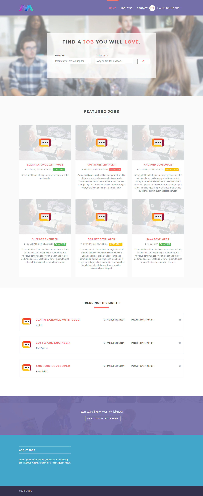
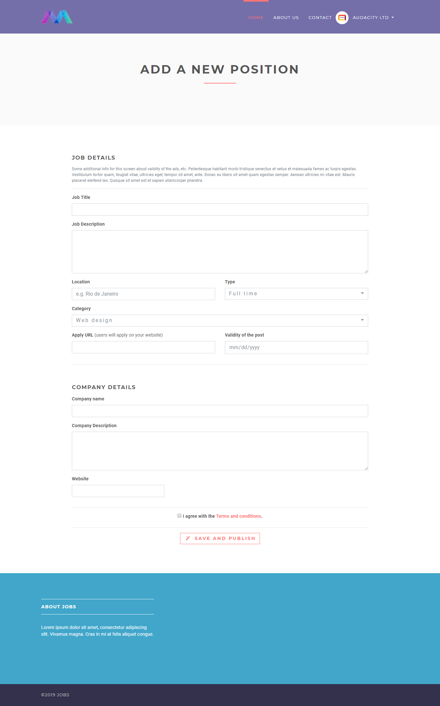
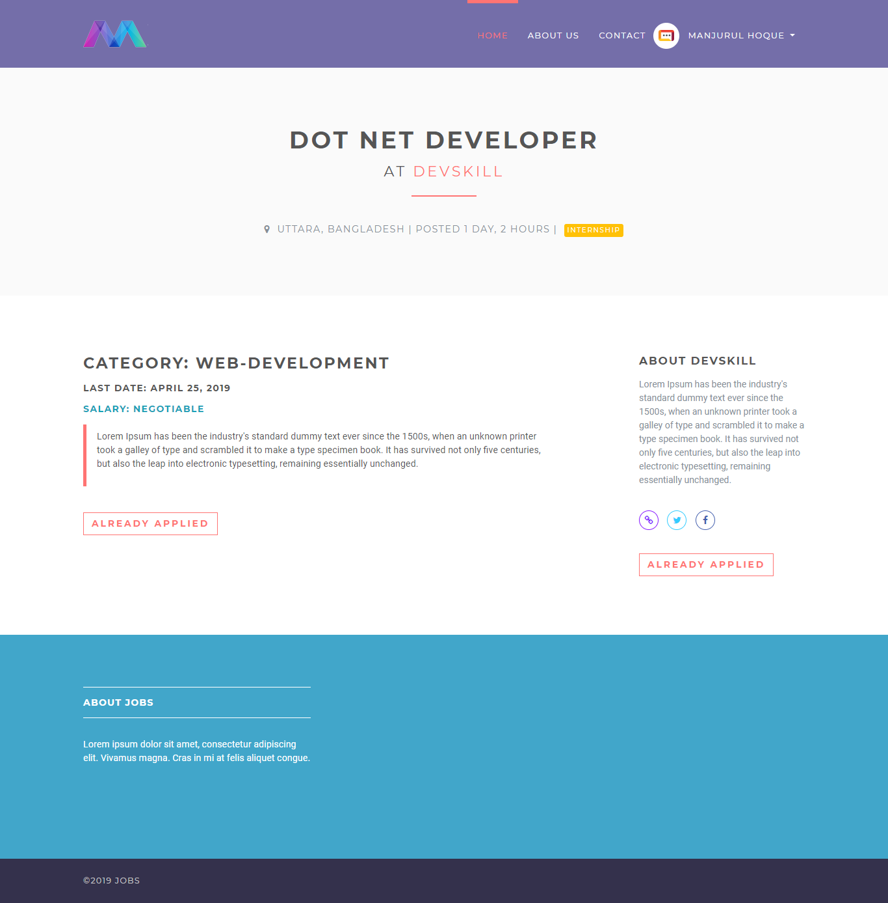

# 💼 Online Job Management System (Django)

A web-based Job Management System built using **Python** and **Django Framework**.  
This system allows employers to post jobs and candidates to search and apply for jobs online.

---

## 🚀 Features

- User Registration & Login
- Employer & Candidate Roles
- Post Job Listings
- Apply for Jobs
- Admin Dashboard
- SQLite Database Integration
- Secure Authentication System

---

## 🛠️ Tech Stack

- **Backend:** Python, Django
- **Frontend:** HTML, CSS, Bootstrap
- **Database:** SQLite
- **Version Control:** Git

---

## 📂 Project Structure

```
online-job-management-system/
│── accounts/
│── jobs/
│── jobsapp/
│── templates/
│── static/
│── manage.py
│── requirements.txt
│── db.sqlite3
```

---

## ⚙️ Installation & Setup Guide

### 1️⃣ Clone the Repository

```bash
git clone <your-repo-link>
cd online-job-management-system
```

---

### 2️⃣ Create Virtual Environment

```bash
python -m venv venv
```

Activate it:

**Windows:**
```bash
venv\Scripts\activate
```

**Mac/Linux:**
```bash
source venv/bin/activate
```

---

### 3️⃣ Install Dependencies

```bash
pip install -r requirements.txt
```

If requirements file fails:

```bash
pip install django
```

---

### 4️⃣ Apply Migrations

```bash
python manage.py migrate
```

---

### 5️⃣ Create Superuser (Admin)

```bash
python manage.py createsuperuser
```

---

### 6️⃣ Run the Server

```bash
python manage.py runserver
```

Open in browser:

```
http://127.0.0.1:8000/
```

Admin panel:

```
http://127.0.0.1:8000/admin
```

---

## 📸 Screenshots







---

## 🎯 Future Improvements

- Add Email Notifications
- Resume Upload Feature
- Job Filtering & Search Optimization
- Deployment on Cloud (AWS/Render)

---

## 👨‍💻 Author

**Rishikesh P. Darunte**  

---
